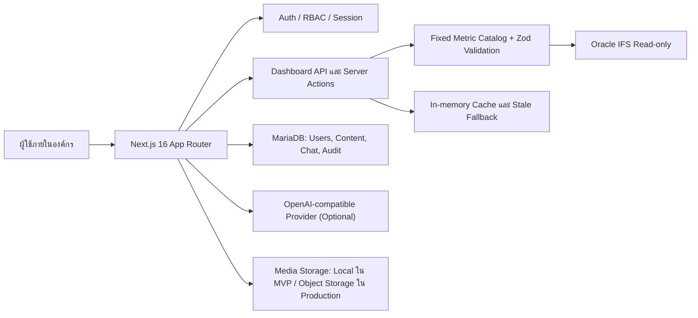

# Project Proposal: TPAD IFS Executive Dashboard

## 1. ข้อมูลเอกสาร

| รายการ | รายละเอียด |
| --- | --- |
| ชื่อโครงการ | TPAD IFS Executive Dashboard |
| หน่วยงานเจ้าของโครงการ | กองบินตำรวจ (Thai Police Aviation Division) |
| ประเภทธุรกิจ | ระบบสารสนเทศเพื่อสนับสนุนการตัดสินใจของผู้บริหาร |
| สถานะปัจจุบัน | MVP/Demo ที่มีฟังก์ชันหลักพร้อมต่อยอดเป็น Pilot และ Production |
| เอกสารฉบับ | 1.0 |
| วันที่จัดทำ | 5 สิงหาคม 2569 |
| ผู้จัดทำ | [ระบุชื่อ/ทีมโครงการ] |
| ผู้อนุมัติ | [ระบุผู้มีอำนาจอนุมัติ] |

> หมายเหตุ: ระยะเวลา งบประมาณ SLA และรายชื่อผู้รับผิดชอบในเอกสารนี้เป็นกรอบข้อเสนอเบื้องต้น ต้องยืนยันอีกครั้งหลังประชุมกับเจ้าของข้อมูล Oracle IFS, ฝ่ายโครงสร้างพื้นฐาน และตัวแทนผู้ใช้งานแต่ละแผนก

## 2. บทสรุปผู้บริหาร

TPAD IFS Executive Dashboard เป็นศูนย์กลางข้อมูลสำหรับผู้บริหารและหัวหน้างานของกองบินตำรวจ เพื่อดูภาพรวมภารกิจจาก IFS ERP ในมุมที่นำไปใช้ตัดสินใจได้ทันที โดยเชื่อมต่อข้อมูลจาก Oracle IFS แบบอ่านอย่างเดียว และใช้ฐานข้อมูล MariaDB สำหรับการยืนยันตัวตน สิทธิ์ผู้ใช้ session เนื้อหาข่าว/บทความ ประวัติการสนทนา และ audit log

ระบบประกอบด้วย Dashboard 4 ด้าน ได้แก่ งานช่างและวางแผนการซ่อม งบประมาณ คลังพัสดุ และจัดซื้อ/จ้างซ่อม รวม 55 metrics/cards ที่นำเสนอเป็น KPI, summary, chart และตารางรายละเอียด มีตัวกรองตามบริบทงาน การเปิดดูรายละเอียด การ refresh และกลไก cache พร้อมแสดงข้อมูลล่าสุดที่ยังใช้ได้เมื่อ Oracle ไม่ตอบสนอง นอกจากนี้มีผู้ช่วย IFS ที่ตอบโดยอ้างอิงเฉพาะ metric ที่อนุญาตและแสดง Card ต้นทางเพื่อให้ตรวจสอบย้อนกลับได้

ข้อเสนอฉบับนี้มีเป้าหมายยกระดับ MVP ให้เป็น Pilot ที่ผ่านการตรวจสอบความถูกต้องกับผู้ใช้จริง มี security baseline ชัดเจน มีคู่มือและแผนดูแลระบบ และพร้อมขยายเป็นระบบ Production ภายใต้การอนุมัติของเจ้าของข้อมูลและหน่วยงานเทคโนโลยีสารสนเทศ

## 3. หลักการและปัญหาที่ต้องแก้ไข

### 3.1 สภาพปัญหา

- ข้อมูลด้านอากาศยาน งานซ่อม งบประมาณ คลัง และจัดซื้ออยู่ในหลายมุมมองของ IFS ทำให้ผู้บริหารต้องเปิดหลายหน้าหรือรอการสรุปข้อมูล
- การเปรียบเทียบสถานะปัจจุบันกับภาระงานคงค้างและกำหนดการในอนาคตทำได้ช้า
- การตอบคำถามเชิงบริหารต้องพึ่งพาผู้เชี่ยวชาญที่รู้โครงสร้างข้อมูลและชื่อ field ใน IFS
- การดึงข้อมูลโดยตรงจากระบบต้นทางโดยไม่มีชั้นควบคุมอาจเพิ่มความเสี่ยงด้าน performance และความปลอดภัย
- ข่าว ประกาศ และองค์ความรู้ที่เกี่ยวข้องกับการใช้งาน Dashboard ยังควรมีพื้นที่เผยแพร่ร่วมกับข้อมูลบริหาร

### 3.2 หลักการออกแบบโครงการ

1. **Read-only by design** — ระบบไม่เขียน แก้ไข หรือลบข้อมูลใน Oracle IFS
2. **Fixed and traceable metrics** — ทุก Card และคำตอบจากผู้ช่วยต้องผูกกับ query catalog ที่ตรวจสอบได้
3. **Security at every action** — ตรวจสอบผู้ใช้และสิทธิ์ใน Server Action/API ไม่พึ่งเฉพาะการซ่อนเมนู
4. **Decision-ready output** — แสดงตัวเลข สถานะ แหล่งที่มา เวลาอัปเดต และตัวกรองที่ใช้
5. **Pilot before scale** — ตรวจสอบนิยาม metric กับเจ้าของข้อมูลก่อนเปิดใช้งานเต็มรูปแบบ

## 4. วัตถุประสงค์

### 4.1 วัตถุประสงค์ทางธุรกิจ

- ให้ผู้บริหารเห็นสถานะสำคัญของกองบินตำรวจจากหน้าจอเดียว
- ลดเวลาการรวบรวมและจัดทำรายงานจากหลายแหล่ง
- ช่วยค้นหาความเสี่ยงที่ต้องดำเนินการ เช่น อากาศยานหยุดบิน งานซ่อมคงค้าง งบประมาณใกล้หมด พัสดุใกล้หมดอายุ และ PO/RFQ ที่ล่าช้า
- สร้างภาษากลางสำหรับการติดตามผลผ่าน metric ที่นิยามร่วมกัน
- ให้ผู้ใช้เข้าถึงข่าว ประกาศ และองค์ความรู้ที่เกี่ยวข้องในระบบเดียว

### 4.2 วัตถุประสงค์ทางเทคนิค

- สร้างชั้นบริการที่อ่านข้อมูล Oracle IFS อย่างปลอดภัยและควบคุมรูปแบบ query
- รองรับการใช้งานตามบทบาท `ADMIN` และ `READ_ONLY`
- เพิ่มความเร็วและความทนทานด้วย cache, timeout, row limit และ stale-data fallback
- ทำให้การเพิ่ม metric หรือ dashboard ใหม่เป็นการแก้ไข catalog และผ่านการทดสอบได้
- มี audit trail สำหรับการจัดการผู้ใช้และเนื้อหา รวมถึงประวัติการใช้งานผู้ช่วย

## 5. สถานะและความสามารถที่มีอยู่ใน MVP

| ด้าน | ความสามารถที่มีอยู่ใน repository |
| --- | --- |
| Web application | Next.js 16 App Router, React 19, responsive UI และ protected layout |
| Authentication | Login ภายในองค์กร, session cookie, ผู้ใช้ active/inactive, ไม่มี public signup |
| Authorization | บทบาท `ADMIN` และ `READ_ONLY`, ตรวจสิทธิ์ใน server-side function |
| Dashboard | 4 dashboard, ECharts, KPI/summary/chart/table, filter, refresh และ detail view |
| Data source | Oracle IFS ผ่าน `oracledb` connection pool แบบ read-only |
| Data safety | fixed query catalog, bind variables, SQL guard, timeout 15 วินาที, max 500 rows, rollback |
| Cache | cache ในหน่วยความจำ 5 นาที และอนุญาต stale fallback ได้ถึง 30 นาที |
| AI assistant | จับ intent ไปยัง metric ที่กำหนด, local summary fallback, optional OpenAI-compatible provider |
| Knowledge hub | ข่าว/บทความ, กลุ่มเนื้อหา, draft/published/archived, pinned content, cover image |
| Admin | จัดการผู้ใช้ กลุ่มเนื้อหา เนื้อหา สถานะ และ reset password |
| Audit | บันทึก action ของผู้ใช้กับ entity ที่เกี่ยวข้อง |
| Database | MariaDB/MySQL ผ่าน Drizzle ORM และ migration ใน `drizzle/` |
| Verification | มีคำสั่ง lint, unit test, production build และ Oracle smoke test |

## 6. ขอบเขตโครงการ

### 6.1 ขอบเขตที่เสนอให้ดำเนินการ

1. ตรวจสอบและรับรองนิยาม metric กับเจ้าของข้อมูลทั้ง 4 แผนก
2. เชื่อมต่อและทดสอบ Oracle IFS ในสภาพแวดล้อมจริงหรือ UAT
3. Hardening ระบบ authentication, authorization, session และ secret management
4. ตรวจสอบความถูกต้องของ filter, timezone, หน่วยวัด และ business rule ของแต่ละ Card
5. ทดสอบ performance ของ query, cache และการใช้งานพร้อมกัน
6. ตรวจสอบความปลอดภัยของ API, Server Action, file upload และ AI integration
7. จัดทำคู่มือผู้ใช้ คู่มือผู้ดูแล และ runbook สำหรับปฏิบัติการ
8. ดำเนินการ UAT กับตัวแทนผู้ใช้งานและแก้ไข defect ก่อน Pilot
9. วางแผน deploy, backup, monitoring และ support หลังเปิดใช้งาน

### 6.2 ขอบเขตที่ไม่รวมในระยะแรก

- การแก้ไข transaction หรือ master data ใน Oracle IFS
- การสร้าง data warehouse หรือเปลี่ยนโครงสร้างฐานข้อมูล Oracle ต้นทาง
- การทำ SSO/LDAP/Active Directory หากยังไม่มีข้อกำหนดและ endpoint ที่พร้อม
- การสร้าง mobile native application แยกจาก responsive web application
- การให้ AI สร้างหรือรัน SQL แบบอิสระจาก catalog
- การส่งรายงานอัตโนมัติทาง email/LINE/แอปภายนอก ซึ่งเสนอเป็น roadmap ระยะถัดไป

## 7. กลุ่มผู้ใช้งานและสิทธิ์

| กลุ่ม | ความต้องการหลัก | สิทธิ์เบื้องต้น |
| --- | --- | --- |
| ผู้บริหาร | ดูภาพรวม KPI และความเสี่ยงข้ามแผนก | `READ_ONLY` |
| หัวหน้าแผนกช่าง/วางแผน | วิเคราะห์ aircraft, WO, PM และ component | `READ_ONLY` |
| หัวหน้าแผนกงบประมาณ | ติดตามงบ ใช้จริง ผูกพัน และ invoice | `READ_ONLY` |
| หัวหน้าแผนกคลัง | ติดตาม MR, MMR, PO, stock และ expiry | `READ_ONLY` |
| หัวหน้าแผนกจัดซื้อ/จ้างซ่อม | ติดตาม RFQ, PR, PO และ supplier | `READ_ONLY` |
| ผู้ดูแลระบบ | จัดการบัญชี สิทธิ์ กลุ่ม เนื้อหา และ audit | `ADMIN` |
| เจ้าของข้อมูล/ผู้ตรวจสอบ | ตรวจนิยามและตัวเลขเทียบกับ IFS | `READ_ONLY` หรือบัญชี UAT |

> ในระยะ Production ควรพิจารณาเพิ่มสิทธิ์ระดับแผนกหรือระดับ Site หากข้อกำหนดด้านการจำกัดการมองเห็นข้อมูลมีความละเอียดกว่าบทบาท 2 ระดับใน MVP

## 8. ความต้องการเชิงฟังก์ชัน

### FR-01 การเข้าสู่ระบบและสิทธิ์

- ผู้ใช้เข้าสู่ระบบด้วยบัญชีที่ Admin สร้างให้
- ระบบรองรับการเปิด/ปิดใช้งานบัญชีและ reset password
- Session ใช้ cookie แบบ HttpOnly, SameSite และ Secure เมื่อเป็น Production
- ทุก Server Action และ API ที่มีข้อมูลต้องตรวจสอบ session ซ้ำ
- Admin เท่านั้นที่จัดการผู้ใช้ กลุ่ม และเนื้อหาได้

### FR-02 Home และการนำทาง

- แสดงลิงก์ไปยัง Dashboard ทั้ง 4 ด้าน
- แสดงสถานะข้อมูลล่าสุดและข่าว/ประกาศสำคัญ
- รองรับ desktop, tablet และ mobile
- มีเมนูหลักและเมนูมือถือพร้อมป้ายกำกับสำหรับ accessibility

### FR-03 Dashboard และตัวกรอง

- แสดง Card ตามหมวดของแต่ละแผนก
- รองรับ KPI, summary, bar, donut, line, gauge และ table
- ใช้ตัวกรองร่วม ได้แก่ Site, Project, Fiscal Year, Location, Buyer, Supplier และช่วงวันที่ตาม metric ที่อนุญาต
- แสดงเวลา generated และสถานะว่าเป็นข้อมูลสดหรือ stale cache
- เปิดดูรายละเอียดของ Card ในรูปแบบตาราง/ข้อมูลดิบที่เกี่ยวข้อง

### FR-04 ขอบเขต metric ของ 4 Dashboard

| Dashboard | จำนวน | ขอบเขตข้อมูลหลัก |
| --- | ---: | --- |
| Maintenance | 19 | สถานะอากาศยาน, WO, MMR, PM, grounded aircraft, new part และ component life/calendar |
| Budget | 9 | งบตั้งต้น, actual, committed, balance, utilization, cost element, invoice และ PO |
| Inventory | 14 | MR/MMR, PO รับเข้า, pick list, turn-in, unserviceable, expiry, low stock และรายการรอคลัง |
| Procurement | 13 | RFQ, PR approval, PO, overdue, delivery, supplier quality/reliability และ trend |
| **รวม** | **55** | **metrics/cards ใน catalog ปัจจุบัน** |

### FR-05 Cache และความทนทาน

- cache ผลลัพธ์ metric ตาม dashboard, metric และ filter
- หาก Oracle ไม่ตอบสนอง ให้แสดง cache ล่าสุดที่ยังไม่เกินเกณฑ์ พร้อมข้อความแจ้งว่าเป็นข้อมูล stale
- มีปุ่ม refresh สำหรับบังคับดึงข้อมูลใหม่
- จำกัดเวลา query และจำนวนแถว เพื่อป้องกันการใช้ทรัพยากรเกินจำเป็น

### FR-06 ข่าวและองค์ความรู้

- Admin สร้าง แก้ไข เผยแพร่ เก็บถาวร และปักหมุดข่าว/บทความได้
- รองรับกลุ่มบทความ summary เนื้อหา และ cover image
- ผู้ใช้ค้นพบเนื้อหาจาก Home และ Knowledge Hub
- เนื้อหาที่เผยแพร่แสดงผู้เขียนและเวลาเผยแพร่

### FR-07 ผู้ช่วย IFS

- รับคำถามภาษาไทย/อังกฤษในขอบเขต metric ที่กำหนด
- map คำถามไปยัง fixed metric เช่น aircraft, WO, งบ, คลัง, RFQ, supplier และ PO
- ดึงข้อมูลตาม filter ที่ตรวจพบ เช่น Site และ Project ID
- สรุปคำตอบจาก DTO ของ Card เท่านั้น ห้ามแต่งตัวเลขที่ไม่มีในข้อมูล
- แสดง Card ต้นทางและเวลา generated เพื่อให้ตรวจสอบต่อได้
- หาก AI provider ใช้งานไม่ได้ ให้ fallback เป็น local summary
- เก็บ conversation และ message เพื่อ audit/ปรับปรุงบริการ ภายใต้นโยบายการเก็บข้อมูลที่ได้รับอนุมัติ

### FR-08 การจัดการระบบและ Audit

- Admin จัดการผู้ใช้ บทบาท สถานะ และรหัสผ่าน
- Admin จัดการกลุ่มบทความและสถานะเนื้อหา
- ระบบบันทึก action, actor, entity, entity ID, metadata และเวลา
- มีรายงานหรือวิธีค้น audit log สำหรับการตรวจสอบในระยะ Production

## 9. สถาปัตยกรรมระบบที่เสนอ

### 9.1 ชั้นแอปพลิเคชัน

- Next.js 16 App Router และ React Server/Client Components
- Protected layout ตรวจสอบผู้ใช้ก่อนเข้าสู่หน้าหลัก
- API routes สำหรับ dashboard, refresh, metric details และ chatbot
- Server Actions สำหรับผู้ใช้ กลุ่ม เนื้อหา และการอัปโหลด
- UI ใช้ Tailwind CSS, Radix UI และ ECharts

### 9.2 ชั้นข้อมูล Oracle IFS

- `lib/dashboard/catalog.ts` เป็นแหล่งกำหนด metric, SQL, bind และชนิดการแสดงผล
- query ต้องขึ้นต้นด้วย `SELECT` หรือ `WITH`
- ปฏิเสธ delimiter/comment และ statement ที่เป็น DML/DDL/transaction control
- ใช้ bind variables และเลือกเฉพาะ query ที่อยู่ใน catalog
- เปิด `SET TRANSACTION READ ONLY` ทุกครั้ง
- กำหนด `callTimeout` 15 วินาที, `maxRows` 500 และ rollback/close connection ใน `finally`

### 9.3 ชั้นฐานข้อมูลแอปพลิเคชัน

MariaDB ใช้เก็บข้อมูลที่ไม่ควรเขียนกลับ Oracle ได้แก่:

- `users`, `sessions` — บัญชีและ session
- `article_groups`, `contents`, `media` — ข่าว บทความ กลุ่ม และสื่อ
- `chat_conversations`, `chat_messages` — ประวัติผู้ช่วย
- `audit_logs` — ประวัติการเปลี่ยนแปลงและ action สำคัญ

## 10. การไหลของข้อมูล

1. ผู้ใช้ login และได้รับ session ที่ตรวจสอบได้
2. ผู้ใช้เปิด Dashboard พร้อม filter ที่ผ่าน schema validation
3. API ตรวจสอบ session และ Dashboard slug
4. Service เลือก metric จาก catalog และสร้าง bind จาก filter ที่พบใน SQL
5. Oracle connection เปิด transaction แบบ read-only แล้ว execute query
6. ระบบ normalize ผลลัพธ์เป็น DTO ตามชนิดของ Card และเก็บ cache
7. UI แสดงผลพร้อม generated time, filter และสถานะ stale
8. เมื่อผู้ใช้เปิดรายละเอียดหรือถาม chatbot ระบบใช้ metric เดิม ไม่เปิดช่องให้ส่ง SQL อิสระ

## 11. ความปลอดภัยและการคุ้มครองข้อมูล

### 11.1 Controls ที่มีอยู่ใน MVP

- ไม่มี public signup; Admin เป็นผู้สร้างบัญชี
- ใช้ bcrypt สำหรับ password hashing และกำหนดความยาวรหัสผ่านขั้นต่ำ 12 ตัวใน action
- ตรวจสอบ session ฝั่ง server ทั้งหน้าและ API
- แยกสิทธิ์ `ADMIN`/`READ_ONLY`
- ใช้ bind variables และ fixed query catalog
- บังคับ read-only transaction, timeout, row limit และ rollback กับ Oracle
- ใช้ Zod ตรวจรูปแบบ filter, request และข้อมูลฟอร์ม
- บันทึก audit log สำหรับการจัดการ entity สำคัญ
- AI ได้รับเฉพาะ DTO ของ metric ไม่ได้สิทธิ์สร้าง SQL หรือเข้าถึง Oracle โดยตรง

### 11.2 งาน Hardening ก่อน Production

- ใช้ Secret Manager/Vault แทนการกระจาย credentials ใน environment หลายจุด
- จัด network segmentation ให้ app server, MariaDB และ Oracle ติดต่อกันเท่าที่จำเป็น
- เพิ่ม rate limit และ monitoring สำหรับ login, API และ chatbot
- กำหนด password policy, session revocation, retention และการแจ้งเตือน login ผิดปกติ
- ทบทวน CSP, security headers, CSRF และ dependency scanning
- เพิ่ม centralized logging, error tracking และการ redaction ของข้อมูลอ่อนไหว
- ตรวจสอบ file upload ด้วย MIME/content sniffing, malware scan, quota และ storage ที่มี backup
- ยืนยันนโยบายการส่งข้อมูลไปยัง AI provider และ retention ของ conversation
- ประเมินสิทธิ์ระดับ Site/แผนกและการ masking หากข้อมูลบางส่วนไม่ควรเห็นข้ามหน่วยงาน

## 12. ข้อกำหนดที่ไม่ใช่ฟังก์ชัน

| ด้าน | เป้าหมายเบื้องต้นสำหรับ Pilot/Production |
| --- | --- |
| Performance | cached dashboard response ภายใน 3 วินาทีในเครือข่ายองค์กร; query ที่ช้าต้องจบ/แจ้งเตือนภายใน timeout ที่กำหนด |
| Availability | เป้าหมาย 99.5% ต่อเดือนสำหรับแอป โดยแยก incident ที่เกิดจาก Oracle ต้นทาง |
| Freshness | แสดงเวลาข้อมูลจริงทุกครั้ง; cache สด 5 นาที และ stale fallback ไม่เกิน 30 นาทีตาม policy |
| Scalability | รองรับผู้ใช้พร้อมกันตามจำนวนที่ยืนยันใน sizing; cache Production ควรย้ายไป shared/distributed เมื่อมีหลาย instance |
| Security | ไม่มี DML ไป Oracle, least privilege, credentials ไม่อยู่ใน source control, audit action สำคัญ |
| Accessibility | keyboard navigation, focus state, accessible label และ contrast ที่เหมาะสม |
| Compatibility | รองรับ browser มาตรฐานขององค์กรบน desktop/tablet/mobile |
| Maintainability | metric เพิ่มได้ผ่าน catalog, มี test และ smoke test ก่อน release |
| Observability | มี health check, error log, query timing, cache hit/miss และ Oracle failure dashboard |

> ค่าเป้าหมายข้างต้นเป็นข้อเสนอ ไม่ใช่ผลรับรองของ MVP จนกว่าจะวัดจาก environment และจำนวนผู้ใช้จริง

## 13. แผนดำเนินงานและระยะเวลาเบื้องต้น

ประมาณการสำหรับการยกระดับจาก MVP ไป Pilot อยู่ที่ 8 สัปดาห์ หลังจาก environment, Oracle access และผู้ทดสอบพร้อม

| ระยะ | ช่วงเวลา | งานหลัก | ผลส่งมอบ |
| --- | --- | --- | --- |
| 1. Discovery และ Data Contract | สัปดาห์ 1 | ยืนยันผู้ใช้, metric, นิยามตัวเลข, filter, Site, timezone และสิทธิ์ | Approved requirement และ metric sign-off plan |
| 2. Environment และ Security Baseline | สัปดาห์ 2 | ตั้งค่า DB/Oracle/network, secrets, migration, session policy, logging | UAT environment และ security checklist รอบแรก |
| 3. Dashboard Validation | สัปดาห์ 3–4 | ทดสอบ 55 metrics, เทียบตัวเลขกับ IFS, tuning query และ filter | Dashboard baseline report และ defect list |
| 4. Content, Admin และ AI Assistant | สัปดาห์ 5 | ทดสอบ RBAC, content workflow, media, audit และ chatbot intent/source | Admin/content acceptance และ chatbot test set |
| 5. Performance, Security และ UAT | สัปดาห์ 6–7 | load test, failure test, stale cache, security review และ user acceptance | UAT sign-off หรือรายการแก้ไขรอบสุดท้าย |
| 6. Pilot Go-live และ Handover | สัปดาห์ 8 | deploy, seed admin, training, runbook, support window | Pilot release และ handover package |

หาก Oracle data dictionary, network access หรือผู้ทดสอบไม่พร้อม ระยะเวลาจะเลื่อนตาม dependency ดังกล่าว ไม่ควรลดขั้นตอน data validation เพื่อเร่ง go-live

## 14. ผลส่งมอบของโครงการ

1. Web application เวอร์ชัน Pilot/Production พร้อม source code และ build artifact
2. Dashboard 4 ด้านและ metric catalog ที่ผ่านการรับรองกับเจ้าของข้อมูล
3. MariaDB migration, bootstrap script และแนวทาง backup/restore
4. Authentication, RBAC, admin workflow และ audit log
5. Knowledge Hub สำหรับข่าว/บทความและ media workflow
6. IFS Assistant พร้อม fixed intent, source Card และ fallback behavior
7. Test report: unit, lint, typecheck, build, integration, UAT และ security checklist
8. Data dictionary/metric catalog document ระบุสูตร, source, filter, unit และ owner
9. คู่มือผู้ใช้, คู่มือ Admin และ runbook ฝ่ายปฏิบัติการ
10. Deployment/configuration document โดยไม่เผยแพร่ secret จริง

## 15. เกณฑ์การทดสอบและการยอมรับงาน

โครงการจะถือว่าพร้อม Pilot เมื่อผ่านเกณฑ์อย่างน้อยดังนี้:

- ผู้ใช้ที่ active login ได้ และผู้ใช้ที่ปิดใช้งานไม่สามารถใช้งานต่อได้
- Admin และ Read-only เห็นเมนูและทำ action ได้ตามสิทธิ์
- Dashboard ทั้ง 4 เปิดได้และแสดง metric ที่ได้รับอนุมัติครบ 55 รายการ หรือมีรายการยกเว้นที่ลงนามรับทราบ
- ตัวเลขตัวอย่างจากแต่ละ Card ตรงกับ Oracle IFS baseline ตาม tolerance ที่เจ้าของข้อมูลกำหนด
- Filter สำคัญ เช่น Site, Project, Fiscal Year, Buyer และ Supplier ให้ผลลัพธ์ถูกต้อง
- Oracle ไม่รับคำสั่ง INSERT/UPDATE/DELETE/DDL จากระบบ และ smoke test ผ่าน
- เมื่อ Oracle ล่มหรือ timeout ระบบไม่ล่มทั้งหน้า และแสดง stale cache/ข้อความผิดพลาดที่เข้าใจได้
- Chatbot ไม่ตอบจาก metric ที่อยู่นอก catalog และทุกคำตอบมี source Card
- Admin สร้าง/แก้ไข/เผยแพร่ข่าวและบทความ พร้อม audit log ได้
- Upload file ผ่านการตรวจชนิด/ขนาดและแสดง cover image ในหน้ารายละเอียดได้
- ผ่าน lint, unit test, typecheck, build และ UAT checklist
- มี backup/restore procedure และผู้รับผิดชอบ support ที่ระบุชื่อชัดเจน

## 16. ตัวชี้วัดความสำเร็จ

| KPI | วิธีวัด | เป้าหมายเบื้องต้น |
| --- | --- | --- |
| เวลาเตรียมรายงาน | เปรียบเทียบก่อน/หลังใช้ Dashboard | ลดลงอย่างน้อย 50% ใน use case ที่เลือก |
| Metric accuracy | เทียบค่ากับ Oracle baseline | ผ่าน 100% ของ metric ที่ลงนามรับรองก่อน Pilot |
| Dashboard adoption | ผู้ใช้เป้าหมายที่เข้าใช้ต่อเดือน | ≥ 80% ในกลุ่ม Pilot |
| Query failure handling | เหตุการณ์ Oracle timeout | มี error/stale state ที่อธิบายได้ 100% |
| Security control | ผลตรวจ checklist/penetration review | ไม่มี Critical/High ที่ยังไม่ยอมรับความเสี่ยง |
| User satisfaction | แบบประเมินหลัง UAT | ค่าเฉลี่ย ≥ 4 จาก 5 |
| Traceability | คำตอบ chatbot ที่มี source Card | 100% ของคำตอบใน scope |

ตัวเลขเป้าหมายต้องปรับตาม baseline จริง จำนวนผู้ใช้ และนโยบายของหน่วยงานก่อนลงนาม

## 17. ความเสี่ยงและแนวทางลดความเสี่ยง

| ความเสี่ยง | ผลกระทบ | แนวทางลดความเสี่ยง | เจ้าของร่วม |
| --- | --- | --- | --- |
| นิยามข้อมูลใน IFS ไม่ตรงกัน | รายงานขัดแย้ง/ขาดความน่าเชื่อถือ | ทำ metric dictionary และ sign-off กับเจ้าของข้อมูล | BA + IFS SME |
| Oracle ช้า/ไม่พร้อมใช้งาน | Dashboard ตอบช้า | timeout, max rows, cache, stale fallback และ tuning query | Infra + DBA |
| สิทธิ์ข้อมูลไม่ละเอียดพอ | เห็นข้อมูลเกินหน้าที่ | ยืนยัน matrix สิทธิ์และเพิ่ม Site/แผนก scope ก่อน Production | Security + Owner |
| AI สรุปคลาดเคลื่อน | ผู้ใช้ตัดสินใจผิด | ส่งเฉพาะ DTO, fixed intent, source Card, fallback และ UAT test set | Product + AI owner |
| Local upload สูญหายเมื่อ deploy | รูป/สื่อหาย | ใช้ object storage/NFS, backup และ migration procedure | Infra |
| Cache หลาย instance ไม่สอดคล้องกัน | ผู้ใช้เห็นข้อมูลต่างกัน | ใช้ shared cache หรือบังคับ single instance ใน Pilot | Tech lead |
| Credential รั่วไหล | เข้าถึงระบบต้นทางโดยมิชอบ | Secret Manager, least privilege, rotation และไม่ commit `.env` | Security |
| ผู้ใช้ไม่ยอมรับรายงานใหม่ | Adoption ต่ำ | ใช้ตัวแทนผู้ใช้ร่วมออกแบบ, training และ feedback loop | PM + Department leads |

## 18. แผนปฏิบัติการและการดูแลหลังส่งมอบ

### 18.1 ก่อนเปิด Pilot

- จัดเตรียม application server, MariaDB, network route และ Oracle read-only account
- ตั้งค่า environment แยก Dev/UAT/Pilot
- ใช้ secret ที่ไม่ซ้ำกันและมี owner/rotation date
- ทำ backup และทดสอบ restore ของ MariaDB และ media
- ตั้ง monitoring สำหรับ process, HTTP error, DB pool, Oracle timeout และ disk/storage

### 18.2 หลังเปิด Pilot

- มี support window อย่างน้อย 2 สัปดาห์สำหรับติดตาม defect และคำถามผู้ใช้
- ทบทวน cache freshness, query time และ error rate รายสัปดาห์
- ทบทวน audit log และบัญชี active อย่างน้อยรายเดือน
- ทบทวน metric definition เมื่อมีการเปลี่ยน IFS configuration หรือ business process
- วาง release process: test → UAT → approval → deploy → smoke test → rollback plan

### 18.3 ความต่อเนื่องทางธุรกิจ

- กำหนด RPO/RTO สำหรับ MariaDB และ media
- มีแผน fallback เป็นรายงานเดิมเมื่อ Oracle หรือแอปใช้งานไม่ได้
- ไม่ถือ stale cache เป็นข้อมูลปัจจุบัน ต้องแสดงเวลาที่ข้อมูลถูกสร้างเสมอ
- เก็บ deployment artifact และ migration version ให้ย้อนกลับได้

## 19. ทรัพยากรและกรอบงบประมาณ

### 19.1 ทีมที่แนะนำ

| บทบาท | ภารกิจ |
| --- | --- |
| Project sponsor | อนุมัติ scope, priority และทรัพยากร |
| Project manager/BA | เก็บ requirement, ประสาน UAT และติดตามความเสี่ยง |
| Full-stack developer | พัฒนา Next.js, API, UI, auth, content และ chatbot |
| Oracle/IFS SME | ตรวจ query, business rule, field และ baseline |
| DBA/Infrastructure | MariaDB, Oracle connectivity, deploy, backup และ monitoring |
| Security reviewer | ตรวจ access control, secret, upload, API และ hardening |
| Department representatives | ทดสอบและรับรองผลลัพธ์ของแต่ละ Dashboard |

### 19.2 หมวดค่าใช้จ่ายที่ต้องประเมิน

- ค่าพัฒนาและปรับปรุงระบบ
- ค่า application/DB server, storage, backup และ monitoring
- ค่า network/security infrastructure และ certificate
- ค่าตรวจสอบความปลอดภัยหรือ penetration test
- ค่า AI provider หากเปิดใช้ external provider
- ค่าฝึกอบรมและจัดทำเอกสาร
- ค่าบำรุงรักษาและ support รายปี

ยังไม่ระบุจำนวนเงินในเอกสารฉบับนี้ เนื่องจากยังไม่มี sizing ผู้ใช้, SLA, topology, licensing และขอบเขต support ที่อนุมัติ

## 20. Roadmap หลัง Pilot

1. SSO/LDAP/Active Directory และ role mapping จากระบบองค์กร
2. Fine-grained access control ตาม Site, หน่วยงาน หรือกลุ่มข้อมูล
3. Shared cache/queue และ horizontal scaling สำหรับหลาย application instances
4. Object storage, image scanning, retention และ media lifecycle
5. Scheduled report, export ที่ผ่านการอนุมัติ และ notification ตามเหตุการณ์
6. Dashboard trend/history ด้วย data mart หรือ warehouse ที่แยกจาก Oracle transaction system
7. Chatbot ที่รองรับคำถามหลาย metric พร้อม citations และ policy guardrail ที่ละเอียดขึ้น
8. Observability dashboard และ alert สำหรับ Oracle latency, stale data และ failed login

## 21. ประเด็นที่ต้องขอการตัดสินใจก่อนเริ่ม Pilot

- ใครเป็นผู้อนุมัติ metric และ data owner ของแต่ละแผนก
- จำนวนผู้ใช้พร้อมกัน, จำนวนบัญชี และกลุ่ม Site ที่ต้องรองรับ
- ต้องจำกัดการมองเห็นข้อมูลตามบทบาท/หน่วยงานมากกว่า `ADMIN` และ `READ_ONLY` หรือไม่
- จะใช้ SSO หรือบัญชีภายในระบบใน Pilot
- จะใช้ local storage, NFS หรือ object storage สำหรับ cover image/media
- นโยบายการใช้ AI provider, ข้อมูลที่ส่งออก, retention และการอนุมัติด้านความมั่นคงปลอดภัย
- ค่า RPO/RTO, SLA, support hours และผู้รับผิดชอบ incident
- tolerance ของตัวเลข, timezone, หน่วยเงิน และ cut-off time ของรายงาน
- รายการ metric ที่ต้องเพิ่ม/ตัดก่อน UAT และวัน sign-off ของแต่ละแผนก

## ภาคผนวก A: ตำแหน่งโค้ดที่เกี่ยวข้อง

| ส่วน | ตำแหน่ง |
| --- | --- |
| Metric catalog และ dashboard metadata | `lib/dashboard/catalog.ts` |
| Query guard และ bind variables | `lib/dashboard/sql-guard.ts` |
| Oracle read-only connection | `lib/dashboard/oracle.ts` |
| Query execution และ cache | `lib/dashboard/service.ts`, `lib/dashboard/cache.ts` |
| Filter/type definitions | `lib/dashboard/types.ts`, `lib/dashboard/validation.ts` |
| Authentication/session | `lib/auth/session.ts`, `app/login/` |
| MariaDB schema/migration | `lib/db/schema.ts`, `drizzle/` |
| Content/admin actions | `lib/content.ts`, `app/(protected)/admin/` |
| Chatbot API/service | `app/api/chat/`, `lib/chat/`, `components/chatbot.tsx` |
| Dashboard UI | `components/dashboard-page.tsx`, `app/(protected)/dashboards/` |
| Runtime configuration | `.env.example`, `next.config.ts`, `proxy.ts` |

## ภาคผนวก B: Definition of Done สำหรับ Release

- [ ] Requirement และ metric dictionary ได้รับการอนุมัติ
- [ ] Oracle read-only account และ network path ผ่านการทดสอบ
- [ ] MariaDB migration/backup/restore ผ่านการทดสอบ
- [ ] User/role matrix และ session policy ได้รับการอนุมัติ
- [ ] 55 metrics ผ่าน baseline/UAT หรือมี waiver ที่ลงนาม
- [ ] Query guard, timeout, row limit และ rollback ผ่าน security review
- [ ] Chatbot test set ผ่าน และทุกคำตอบมี source Card
- [ ] Content/media upload ผ่าน file validation และ backup test
- [ ] Performance, accessibility และ browser smoke test ผ่าน
- [ ] ไม่มี Critical/High defect ค้างโดยไม่มี risk acceptance
- [ ] มี deployment, rollback, monitoring และ incident contact
- [ ] มีคู่มือผู้ใช้ Admin และ runbook พร้อมส่งมอบ
